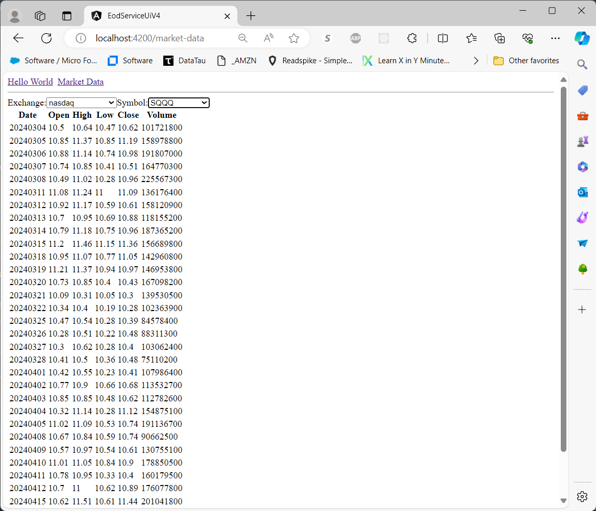

# Yet Another EOD Service UI for Browsing Historical Stock Market OHLCV Data

## Description:
- A very simple [Angular](https://angular.io/) front end for [EOD Service](https://github.com/mring33621/eod-service) REST API.
- Uses the [Angular Router](https://angular.io/api/router) component for switching between multiple 'pages'
- Uses webpack/angular's built-in proxy to forward requests to the EOD Service API, avoiding CORS issues, in local/dev mode
- I built this in order to learn a bit about the Angular web development framework
- Similar to the [React version](https://github.com/mring33621/eod-service-ui-v2) and [Vuejs version](https://github.com/mring33621/eod-service-ui-v3) of the same project, but with Angular

## TODO:
- [ ] Add some styling
- [ ] Add some graphs
- [ ] Add a 'Symbol Search' component
